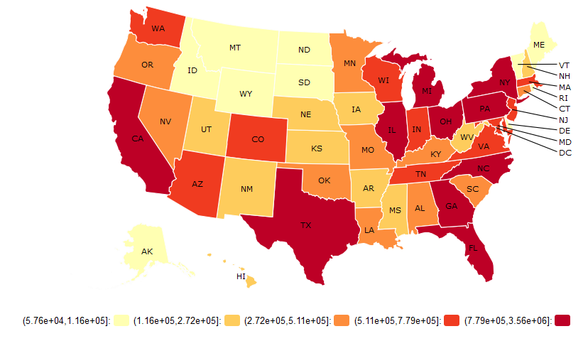

### Percentage of single males earning more than 10K annually

### Expected total number of single males earning more than 10K annually

### Percentage of single females younger between 16-29 years old, graduated from college, and have a job

### Expected total number of single females younger between 16-29 years old, graduated from college, and have a job

